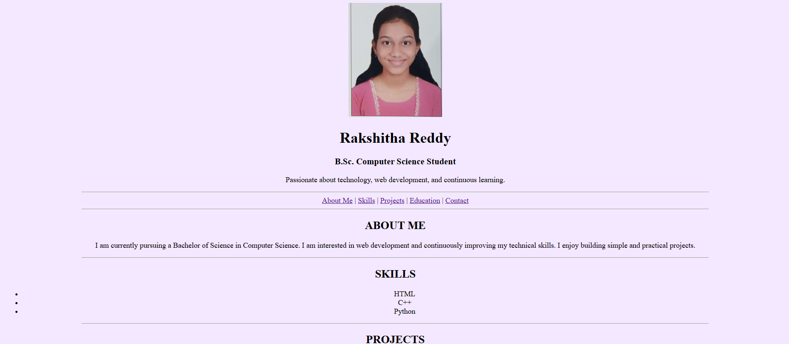
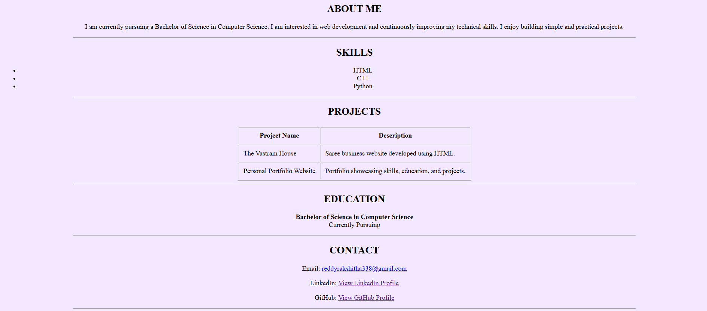

# Personal Portfolio Website

## Description

A simple personal portfolio website developed using HTML. The website presents my profile, skills, projects, education, and contact details in a structured and easy-to-navigate format.

## Features

* Personal Introduction
* About Me Section
* Skills Display
* Projects Showcase
* Education Information
* Contact Details
* Internal Navigation Links
* Beginner-Friendly HTML Design

## Technologies Used

* HTML5

## Website Preview

## Learning Outcomes

* Creating a personal portfolio using HTML
* Working with images, tables, and hyperlinks
* Using internal page navigation
* Organizing webpage content effectively

